# SocialSync (Unit 7)

## Table of Contents

1. [Overview](#Overview)
1. [Product Spec](#Product-Spec)
1. [Wireframes](#Wireframes)

## Overview

### Description

It is hard to schedule times to meet when you are a college student, everyone in the friends group has conflicting schedules. We are coming with an App where users can schedule time to meet by selecting the times they are available. Our app is a mobile version of the https://www.when2meet.com/ website, it also shows the weather information on the day of meeting.

### App Evaluation

**Category** - Social

**Mobile** - Our app is a mobile version of the WhenToMeet website, we are making it mobile by using GPS location services for finding the weather, push notifications for updates and remainders, sound effects for notifications and deletion of events, we are also using firebase's real time database so the changes are instant

**Story** - The main motivation behind this app is to make scheduling events easy for college students, college students often have very different schedules and it is hard for them to plan and go for events, this is where our app excels, users can choose the days and the time they are free and the event creator can choose a time when all people are free, our app also shows the weather data so that the events can be scheduled without any inconvenience.

**Market**

#### Market size and uniqueness

Our app enters the market as a unique solution by combining the when2meet functionality integrated with real time weather data, so users can decide the type of the meeting/event either indoor or outdoors.

#### Size and Scale of potential user base

The potential user base of our app can extend to millions, we believe that our app will be used by students and working professionals to schedule study sessions and work meetings.

#### Value to Niche group

SocialSync uniquely caters to college students and working professionals by simplifying the coordination of meetups despite hectic schedules, integrating real-time weather data for informed planning, and ensuring instant updates through a mobile platform, making it an helpful tool for developing community and connectivity.

**Habit**

This app is made for college students and working professionals, they will need to schedule meetings very often, so we believe people are likely to use our app at least once evey week.

The app has a great balance between consumption and creation, users not only consume information through updates from events and weather forecasts they also actively create by scheduling their available times and creating events. This dual interaction ensures that the interaction is continuous.

**Scope**

#### Technical Challenges

It can be challenging to finish this app, we are planning to use Google Authentication and we will use firebase for that, the GPS and weather data can be retrieved using the respective APIs, we are also using firebase's realtime database for real time updates.

The real challenges are designing the UI, designing the database schema so that users can create events and others can join them or update the availability and also implementing the link share feature. We want users to share an event information as a link so that other users can update their availability.

## Product spec

### 1. User Features

#### Required Features

1. Users can signup/login with their gmail accounts(Google Auth)
2. Users can create events, each event has a name, location, options and an optional password.
    - Options can set the type of an event like the event creator can choose to make the event a chatroom or inperson, he can also make other users see the participants and make the event public.
3. Event creators can select and choose the available times and also the days, either by selecting the days of a week in general or specific dates.
4. Event creators can share an event link to their friends and contacts, and the people who received the link can input their times and access the event information by opening the link.
5. Users have a navigation bar at the bottom of the screen which has 3 options, dashboard, events and profile
6. On the dashboard screen users can see the current date, day and time and a recycler view of their upcoming events.
7. On the events screen users can see their public events from another apps like any college events or other
8. On profile screen users can edit their notification and remainder settings

#### Optional Features

1. Exporting events to google calendar
2. Email/Password authentication 

### 2. Screen Archetypes

1. Login/Signup screen
   - The app has a login/signup screen where an user can register for the app using their gmail and also login if they already registered
2. Add event screen - Part1
   - This screen lets users create new events with a name, location, optional password and other options
3. Add event screen - Part2
   - This screen lets users choose the time of the event and the days both general days of a week or specific dates for the event to take place
4. Add event screen - Part3
   - This screen lets the user choose the specific dates they want from a calendar window
5. Add event screen - Part4
   - This screen lets event creators edit the time or share the link to their friends or contacts
6. Dashboard Screen
   - This screen shows the current date and time and also a recycler view of upcoming events
7. Public Events
   - This screen shows all the upcoming events from another app like a list of college events from the college website
8. Even details host 
   - This screen is only visible to an event creator and lets the event creator to modify the time or event details with two buttons
9. Event details users
   - This screen is visible to users who received the link, and they can select their availability in this screen
10. Modify Event
    - This screen is only accessible by the event creator to change the event details like name, password and type, this screen can be reached by clicking the Modify Event button on the Event details host page
11. Modify Time
    - This screen is only accessible by the event creator to change the event time
12. Google Maps
    - This screen can be accessed from the Event details page, which shows the event location in google maps
13. Settings
    - This screen allows users to edit notification settings and to export the events to google app

### 3. Navigation

The app has a navbar on the bottom the screen, the navbar handles most of the navigation.
The navbar has 3 buttons
   - Dashboard
     - The Dashboard button takes the user to the dashboard screen, where the user can see his upcoming events
   - Events
     - The Events button takes the user to the events screen, where the user can see events from other apps like a list of college events
   - Profile
     - The Profile tab takes the user to settings page
Event details page can be navigated by going to the dashboard and clicking on the event
Modify time and Modify event screens can be navigated by the event creator by clicking the respective buttons on the event details page
Add new event screen can be accessed by clicking the plus icon on the event dashboard screen
Add time buttons and the link share screen can be accessed from the respective buttons on the screens

## Wireframes

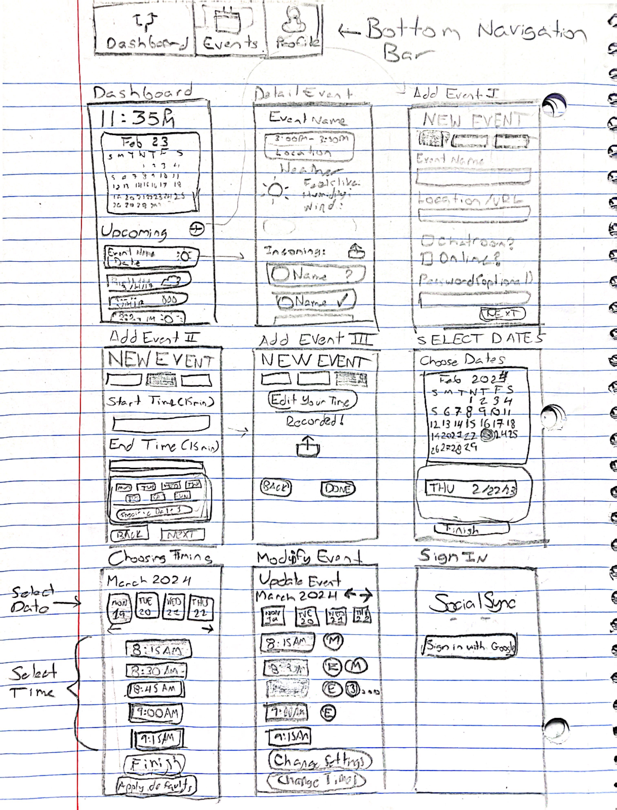

## Digital Wireframes

### Add Event

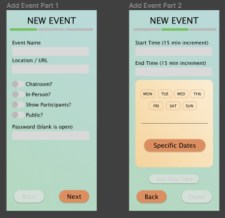
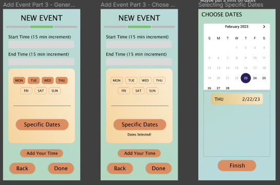
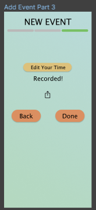

### Choose Time

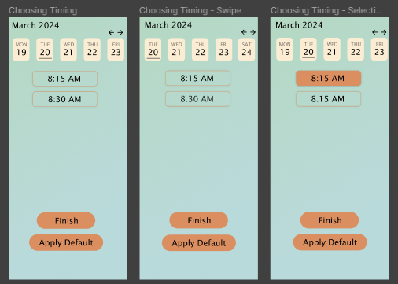

### Event Details

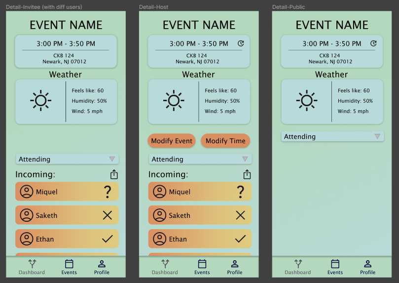

### Modify Events

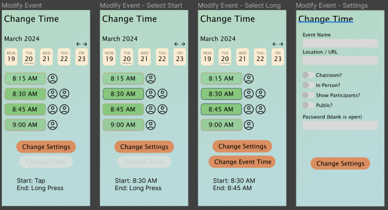

### Profile Signup

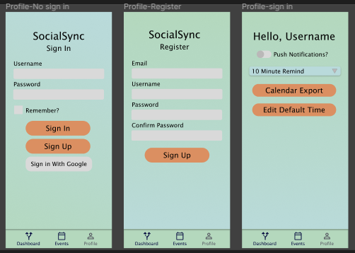

### Public Events

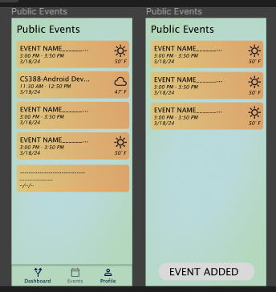

### Dashboard

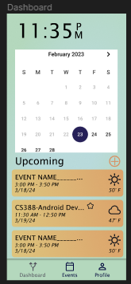

## Interactive Prototype

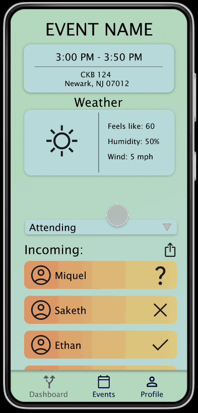

